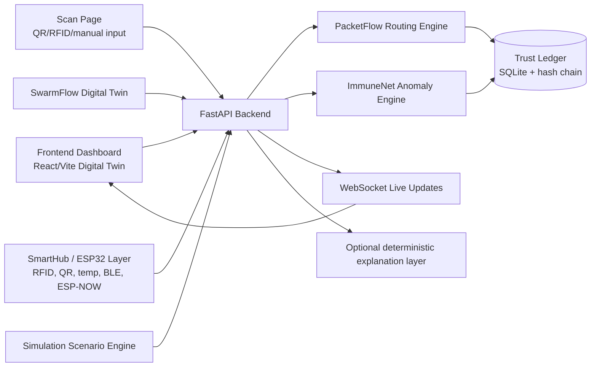

# PacketFlow ImmuneNet

**TCP/IP for parcels, with an immune system for trust.**

PacketFlow ImmuneNet is a trust-aware logistics protocol for FAR AWAY 2026 Round 1. Modern logistics systems often track claims that a parcel moved. PacketFlow ImmuneNet verifies whether each movement could physically have happened using scan identity, GPS/geofence proof, timestamp and speed plausibility, route graph validity, temperature state, tamper state, hub trust, and live rerouting.

The MVP combines a FastAPI backend, a React/Vite digital twin dashboard, deterministic simulation scenarios, an event ledger, WebSocket live updates, and SmartHub hardware-ready ESP32 assets. The project started as VeriRoute Nexus; the submission-facing product name is **PacketFlow ImmuneNet**.

Final line: **We are not tracking parcels. We are proving movement.**

## Run Locally

Use two terminals.

Terminal 1, backend:

```bash
cd backend
python3 -m venv .venv
source .venv/bin/activate
pip install -r requirements.txt
./run.sh
```

Terminal 2, frontend:

```bash
cd frontend
npm install
npm run dev
```

Open:

```text
http://localhost:5173/dashboard
```

Reset the demo:

```bash
curl -X POST http://localhost:8000/demo/reset
```

Run verification:

```bash
cd backend
source .venv/bin/activate
pytest

cd ../frontend
npm run typecheck
npm run build
```

More detail: [Demo Guide](docs/DEMO_GUIDE.md) and [API Reference](docs/API.md).

## Live Deployment

Full deployment:

```text
https://packetflow-immunenet.vercel.app
```

This Vercel deployment serves both the React/Vite dashboard and the FastAPI backend:

- Frontend: `https://packetflow-immunenet.vercel.app/dashboard`
- Backend health: `https://packetflow-immunenet.vercel.app/api/health`
- Backend docs are still available locally at `http://localhost:8000/docs`; the Vercel demo exposes the API routes under `/api`.

The hosted backend uses Vercel Services and an ephemeral SQLite database in `/tmp`. That is enough for a live hackathon demo with reset/seed flows, but production should move state to Postgres or another managed database.

Deploy commands:

```bash
vercel pull --yes --environment=preview
vercel deploy --prod
```

## 30-Second Explanation

Logistics networks break when scans are trusted blindly. A fake scan, impossible travel speed, wrong geofence, cold-chain breach, or tampered package can make a dashboard look normal while the parcel is compromised. PacketFlow ImmuneNet treats each scan as a movement claim. Proof-of-Movement validates the claim, ImmuneNet blocks or warns on anomalies, the trust ledger updates hub reputation, and PacketFlow chooses the next route based on trust, congestion, SLA, cold-chain needs, cost, and disruption state.

## Problem

- Rigid route plans fail when hubs are overloaded, blocked, or unsafe.
- Tracking systems often record a scan without proving the scanner was physically near the hub.
- Fake scans, clone scans, and impossible movement can pass as normal status updates.
- Cold-chain parcels need temperature-aware routing, not only location updates.
- Logistics networks need hub-level trust scores and auditable proof, not only carrier claims.

## Solution

- **PacketFlow Routing Engine:** dynamic next-hop routing over a hub graph.
- **Proof-of-Movement Ledger:** hash-linked event ledger for accepted, blocked, and rerouted movement claims.
- **ImmuneNet Anomaly Engine:** geofence, speed, graph, clone, cold-chain, tamper, handshake, mesh witness, and statistical checks.
- **AgentOps Disruption Replanner:** deterministic scenario handlers for hub failure, overload, traffic, weather, and temperature breach.
- **SwarmFlow Digital Twin:** React dashboard for route decisions, trust, alerts, metrics, and live events.
- **SmartHub Relay Node:** ESP32/RFID/QR/GPS/temperature/BLE/ESP-NOW-ready hardware layer and simulator.

## Real Vs Simulated

| Boundary | What is included |
| --- | --- |
| Real in MVP | FastAPI endpoints; SQLite/SQLAlchemy state; PacketFlow route scoring; ImmuneNet scan validation; trust updates; ledger hashing; WebSocket broadcasts; React dashboard pages; demo reset/seed/snapshot; hardware scan bridge endpoint. |
| Simulated in MVP | Hub graph, parcel movement scenarios, traffic/weather/hub disruption inputs, digital twin map layout, hardware simulator actions, demo data for `MED-104`. |
| Hardware-ready | ESP32 Smart Relay Hub firmware, Smart Parcel Tag firmware, RFID/QR/GPS/temperature/BLE payload shape, ESP-NOW handshake endpoint, CAD/PCB/pin-map documentation, Python hardware simulator. |
| Future roadmap | Real multi-site deployment, production identity provisioning, carrier integrations, secure device keys, real GPS permission flows at scale, ONDC/e-commerce integration, hosted observability, production auth, and multi-tenant fleet operations. |

More detail: [Feature Status](docs/FEATURE_STATUS.md), [Hardware](docs/HARDWARE.md), and [Simulation](docs/SIMULATION.md).

## Architecture



More detail: [Architecture](docs/ARCHITECTURE.md).

## System Flow

1. Parcel is created or seeded as `MED-104`.
2. Scan event is submitted from the dashboard, scan page, demo control, or hardware bridge.
3. Proof-of-Movement validates identity, geofence, timestamp/speed plausibility, route graph, temperature, tamper, and optional hardware context.
4. ImmuneNet returns `ACCEPTED`, `WARNING`, `BLOCKED`, `REROUTED`, or `HOLD`.
5. Hub trust score changes and trust history is stored.
6. PacketFlow recalculates route decisions from the current hub.
7. WebSocket broadcasts update the dashboard.
8. Ledger entry is persisted with hash-chain fields.
9. The system accepts, reroutes, blocks, or holds the movement claim.

## Features

| Group | MVP behavior |
| --- | --- |
| PacketFlow Routing Engine | Scores candidate next hops using SLA risk, congestion, trust risk, condition/cold-chain risk, and cost/emission. |
| Proof-of-Movement Scan Validation | Treats every scan as a movement claim and verifies physical plausibility. |
| ImmuneNet Anomaly Engine | Blocks fake scans, clone scans, impossible graph moves, and suspicious geofence/speed failures. |
| AgentOps Disruption Replanner | Replans routes for hub failure, overload, traffic jam, weather risk, and temperature breach scenarios. |
| SwarmFlow Digital Twin | Shows hubs, route path, parcels, alerts, ledger, trust board, and demo controls. |
| Hub Trust Ledger | Stores event history, route decisions, trust score deltas, and ledger hashes. |
| Cold-Chain Breach Handling | Detects hot medicine parcel conditions and prefers cold-chain routing such as `COLD-HUB-C`. |
| Fake Scan / Impossible Movement Blocking | Provides explicit fake, clone, route, and speed scenarios. |
| SmartHub Hardware Interface | Accepts ESP32-native scan payloads and peer handshakes through `/hardware/*`. |
| Demo Scenario Controls | Frontend and scripts trigger reset, scan, reroute, fake scan, breach, and hardware paths. |
| Explainable Decision Panel | Backend returns reasons and candidate score breakdowns for judge-readable decisions. |

More detail: [Feature Status](docs/FEATURE_STATUS.md).

## Demo Scenarios

| Scenario | How to demonstrate |
| --- | --- |
| Normal medicine parcel route | Reset demo, create or seed `MED-104`, submit valid `HUB-A` scan, show `ACCEPTED`, green LED, route decision, and ledger entry. |
| Hub overload reroute | Trigger `POST /scenario/overload-hub` or dashboard overload control, then show AgentOps reroute and updated candidate scores. |
| Fake scan from wrong location | Trigger `POST /scan/fake`, show `BLOCKED`, `fake_scan_blocked`, trust decay, and red alert. |
| Impossible movement / speed violation | Submit scans too close in time across distant hubs or use clone scenario; show speed/clone failure. |
| Cold-chain breach reroute | Trigger `POST /scenario/temp-breach` with temperature above limit; show cold-chain alert and route via cold-capable hubs. |
| Trust score decay | Run fake/tamper/blocked events and open Trust Board or `/trust/history/HUB-C`. |
| AgentOps disruption replanning | Trigger fail hub, traffic jam, or weather risk scenario and show old route vs new route. |
| Fixed-route comparison vs PacketFlow | Use route decision candidate scores to explain why dynamic routing avoids unsafe or overloaded paths. |

More detail: [Demo Guide](docs/DEMO_GUIDE.md).

## API Routes

The backend is FastAPI and the following table is generated from the actual route modules in `backend/app/routes`. More request/response examples are in [API Reference](docs/API.md).

| Method | Path | Purpose | Request body example | Response example | Used by |
| --- | --- | --- | --- | --- | --- |
| GET | `/health` | Health check | None | `{"status":"ok"}` | Frontend, smoke checks |
| GET | `/ready` | Readiness with dependency checks | None | `{"status":"ready"}` | Operators |
| POST | `/demo/seed` | Seed deterministic demo state | None | `{"status":"seeded"}` | Demo |
| POST | `/demo/reset` | Reset demo database state | None | `{"status":"seeded"}` | Demo, scripts |
| GET | `/demo/snapshot` | Return dashboard state bundle | None | hubs, edges, parcel, latest route, metrics | Frontend |
| POST | `/demo/validate` | Run backend demo validation | `{}` | validation result | Demo |
| POST | `/demo/run/main-wow` | Run scripted demo sequence | `{}` | scenario summary | Demo |
| POST | `/demo/toggle-sync` | Toggle offline sync simulation | `{}` | sync status | Demo |
| POST | `/demo/flush-sync` | Mark unsynced events synced | `{}` | flush count | Demo |
| GET | `/hubs` | List hub graph nodes | None | `{"hubs":[...]}` | Frontend |
| GET | `/edges` | List graph edges | None | `{"edges":[...]}` | Frontend |
| POST | `/parcels` | Create/upsert parcel and initial route | `{"id":"MED-104","source_hub":"HUB-A"}` | parcel and initial route | Frontend/demo |
| GET | `/parcels` | List parcels | None | `{"parcels":[...]}` | Frontend |
| GET | `/parcels/{parcel_id}` | Parcel detail and latest events | None | parcel, latest events | Frontend |
| GET | `/ledger/events` | List event ledger, optional filters | Query params | `{"events":[...]}` | Frontend/demo |
| GET | `/ledger/parcel/{parcel_id}` | Parcel-specific ledger and proof context | None | events, route, trust, immune checks | Frontend |
| GET | `/ledger/verify/{parcel_id}` | Verify event hash chain | None | validity summary | Frontend/demo |
| GET | `/metrics` | Return demo impact metrics | None | metric counters | Frontend |
| POST | `/route/next-hop` | Calculate PacketFlow next hop | `{"parcel_id":"MED-104","current_hub":"HUB-A"}` | route decision | Frontend/demo |
| GET | `/route/decisions` | List route decisions | None | route history | Demo/docs |
| GET | `/route/decisions/{parcel_id}` | List route decisions for parcel | None | route history | Demo/docs |
| GET | `/route/{parcel_id}` | Latest route for parcel | None | route decision | Frontend |
| POST | `/scan` | Submit movement claim | `{"parcel_id":"MED-104","hub_id":"HUB-A","gps":{"lat":11.0168,"lng":76.9558}}` | scan decision | Frontend/demo |
| POST | `/scan/fake` | Simulate fake scan | `{"parcel_id":"MED-104","claimed_hub":"HUB-C","fake_gps":{"lat":11.1,"lng":77.1}}` | blocked decision | Demo |
| POST | `/scan/clone` | Simulate clone scan | `{"parcel_id":"MED-104","first_hub":"HUB-B","second_hub":"HUB-D"}` | blocked decision | Demo |
| POST | `/scan/tamper` | Simulate tamper scan | `{"parcel_id":"MED-104","hub_id":"HUB-C","tamper":true}` | hold decision | Demo |
| GET | `/trust/hubs` | Hub trust board | None | `{"hubs":[...]}` | Frontend |
| GET | `/trust/history/{hub_id}` | Trust score history | None | `{"history":[...]}` | Frontend |
| POST | `/scenario/fail-hub` | Simulate failed hub | `{"hub_id":"HUB-B","parcel_id":"MED-104"}` | old/new routes | Demo |
| POST | `/scenario/overload-hub` | Simulate congestion | `{"hub_id":"HUB-B","congestion":0.95}` | old/new routes | Demo |
| POST | `/scenario/traffic-jam` | Simulate risky edge | `{"from_hub":"HUB-B","to_hub":"HUB-E","traffic_risk":0.95}` | old/new routes | Demo |
| POST | `/scenario/weather-risk` | Simulate weather risk | `{"from_hub":"HUB-B","to_hub":"HUB-E","weather_risk":0.9}` | old/new routes | Demo |
| POST | `/scenario/temp-breach` | Simulate cold-chain breach | `{"parcel_id":"MED-104","hub_id":"HUB-A","temperature_c":29.2}` | reroute/alert result | Demo |
| POST | `/hardware/scan` | Accept ESP32/native scan payload | `{"device_id":"ESP32-HUB-A-01","hub_id":"HUB-A","parcel_id":"MED-104","lat":11.0168,"lng":76.9558}` | hardware scan decision | Hardware/simulator |
| POST | `/hardware/p2p-handshake` | Log ESP-NOW relay handshake | `{"sender_hub":"HUB-A","receiver_hub":"HUB-B","parcel_id":"MED-104","message_type":"TRUST_SYNC"}` | event id and reason | Hardware/simulator |
| GET | `/ws/status` | WebSocket availability | None | connection count | Frontend |
| WS | `/ws` | Live event stream | WebSocket | event envelope | Frontend |
| GET | `/` | Root project metadata | None | project summary | Browser |

## WebSocket Events

WebSocket messages are envelopes: `{"type":"event_type","timestamp":"...","payload":{...}}`.

Implemented event types include `parcel_created`, `scan_received`, `movement_accepted`, `movement_blocked`, `movement_warning`, `route_decision`, `reroute_triggered`, `trust_updated`, `temperature_breach`, `fake_scan_blocked`, `clone_scan_blocked`, `tamper_alert`, `hub_failed`, `hub_overloaded`, `traffic_jam`, `weather_risk`, `immune_alert`, `p2p_handshake`, `metrics_updated`, `demo_reset`, `hardware_scan_received`, `hardware_scan_completed`, `ble_tag_detected`, and `esp_now_prior_acceptance`.

The `simulation_update` name is not a separate current event; simulation changes are emitted through scenario-specific events plus `reroute_triggered` and `metrics_updated`.

## Full Setup

Clone and enter the repo:

```bash
git clone https://github.com/itsriteshs/VeriRoute_Nexus.git
cd VeriRoute_Nexus
```

Backend:

```bash
cd backend
python3 -m venv .venv
source .venv/bin/activate
pip install -r requirements.txt
./run.sh
```

Frontend:

```bash
cd frontend
npm install
npm run dev
```

Reset demo data:

```bash
curl -X POST http://localhost:8000/demo/reset
```

Run tests and builds:

```bash
cd backend
source .venv/bin/activate
pytest

cd ../frontend
npm run typecheck
npm run build
```

Optional hardware simulator:

```bash
cd hardware_submission/simulation
python3 simulate_hardware.py
```

More detail: [Hardware](docs/HARDWARE.md) and [Demo Guide](docs/DEMO_GUIDE.md).

## Environment Variables

| File | Variable | Required | Purpose |
| --- | --- | --- | --- |
| `.env.example` | `BACKEND_URL` | Optional | Root-level backend URL hint for scripts/docs. |
| `.env.example` | `FRONTEND_URL` | Optional | Root-level frontend URL hint. |
| `.env.example` | `DEMO_MODE` | Optional | Marks local deterministic demo mode. |
| `backend/.env.example` | `DATABASE_URL` | Optional | Intended DB URL; current app uses SQLite config from backend settings. |
| `backend/.env.example` | `FRONTEND_ORIGIN` | Optional | CORS/documentation hint. |
| `backend/.env.example` | `DEMO_MODE` | Optional | Demo mode flag. |
| `frontend/.env.example` | `VITE_API_BASE_URL` | Optional | Frontend API base, defaults to `http://localhost:8000`. |
| `frontend/.env.example` | `VITE_WS_URL` | Optional | WebSocket URL, defaults to `ws://localhost:8000/ws`. |

No AI API key is required for the MVP. Explanations are deterministic/template-based in the backend.

## Project Structure

```text
backend/              FastAPI app, SQLAlchemy models, engines, routes, schemas, tests, scripts
frontend/             React/Vite dashboard, digital twin, pages, components, API client
hardware_submission/  ESP32 firmware, simulator, CAD, PCB, wiring, hardware documentation
data/                 Demo hubs, edges, parcels, scenarios
docs/                 Judge-facing docs, architecture, API, simulation, hardware, evaluation
presentation/         Demo script, backup plan, Q&A, screenshots checklist
scripts/              Root helper scripts for backend/frontend/reset/seed
API_CONTRACT.md       Original API coordination contract
DEMO_RUNBOOK.md       Existing demo runbook
PROJECT_STATUS.md     Current project status notes
what_is_done_*.md     Team member progress trackers
```

The root also contains team workflow and integration notes such as `TEAM_WORKFLOW.md`, `INTEGRATION_CHECKLIST.md`, `PRIVACY_AND_TRUST.md`, and `CONTRIBUTING.md`. These are supporting documents; the fastest judge path is this README plus the focused files in `docs/`.

## Screenshots

See [Screenshots To Add](docs/screenshots/README.md) for the screenshot capture list. Judges should expect dashboard overview, digital twin, fake scan blocked, cold-chain breach, trust ledger, API docs, and hardware setup screenshots.

## Reliability And Fallback Plan

- If RFID fails, use the frontend scan page at `/scan/HUB-A?parcel_id=MED-104`, the dashboard controls, or direct `POST /scan`.
- If GPS permission fails, use demo coordinates in the request body.
- If temperature sensor fails, trigger deterministic breach through `/scenario/temp-breach`.
- If the AI explanation layer fails, use deterministic backend reason strings.
- If hardware fails, run the software-only dashboard and `hardware_submission/simulation/simulate_hardware.py`.
- If internet fails, run the full localhost demo with SQLite and Vite.

## Scalability

PacketFlow ImmuneNet can start as a campus or warehouse pilot, then expand to a city micro-hub network, multi-carrier parcel exchange, ONDC/e-commerce logistics, pharma/cold-chain compliance, disaster relief routing, and cross-border checkpoint logistics. The protocol concept scales because it separates proof ingestion, movement validation, hub trust, and routing decisions.

More detail: [Simulation](docs/SIMULATION.md) and [Architecture](docs/ARCHITECTURE.md).

## Privacy And Safety

The system verifies logistics events, not workers or customers continuously. It stores parcel IDs, scan-time scanner/hub location, temperature state, event reasons, and hub trust scores. It does not need continuous personal location tracking. In production, device identity and parcel IDs should be scoped, rotated where appropriate, and governed by retention rules.

## More Docs

- [Architecture](docs/ARCHITECTURE.md)
- [API Reference](docs/API.md)
- [Demo Guide](docs/DEMO_GUIDE.md)
- [Simulation](docs/SIMULATION.md)
- [Hardware](docs/HARDWARE.md)
- [Feature Status](docs/FEATURE_STATUS.md)
- [Screenshots To Add](docs/screenshots/README.md)

**We are not tracking parcels. We are proving movement.**
