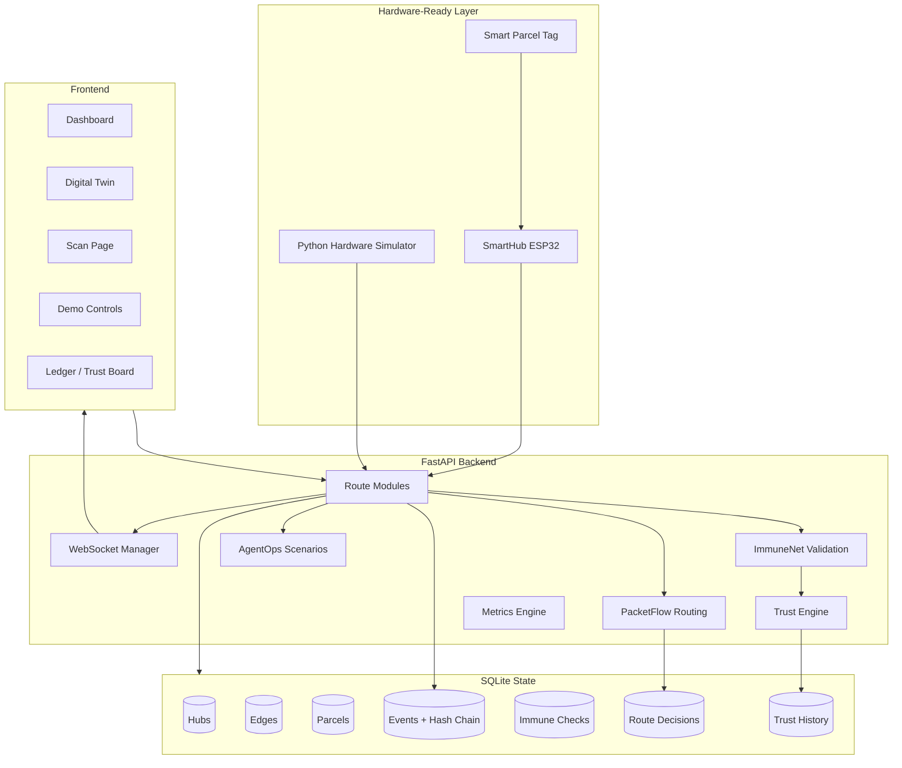
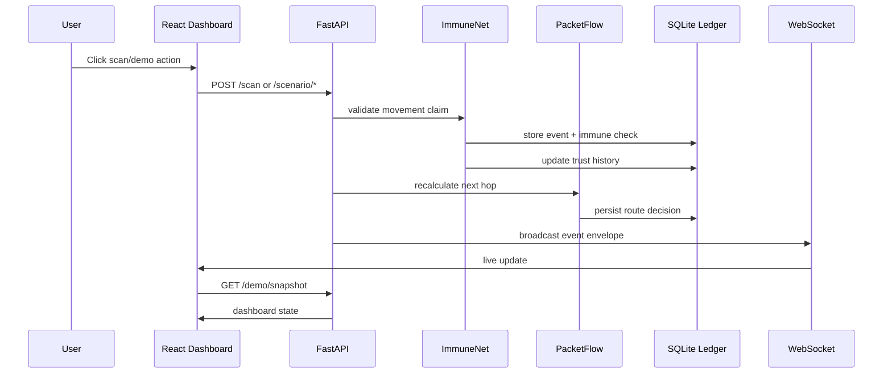

# Architecture

PacketFlow ImmuneNet has four MVP layers:

1. **Interaction layer:** React/Vite dashboard, scan page, demo controls, hardware simulator.
2. **Protocol API layer:** FastAPI routes for scans, routes, scenarios, trust, ledger, hardware, metrics, and live WebSocket events.
3. **Decision layer:** PacketFlow routing, ImmuneNet validation, AgentOps replanning, trust engine, metrics engine.
4. **State/proof layer:** SQLite/SQLAlchemy models for hubs, edges, parcels, events, immune checks, route decisions, trust history, and disruptions.

## High-Level Diagram



## Backend Module Architecture

| Module | Role |
| --- | --- |
| `backend/app/main.py` | App creation, CORS, router registration, `/ws`, `/ws/status`, root route. |
| `backend/app/routes/*.py` | API route boundaries for demo, scans, scenarios, hardware, metrics, parcels, routing, trust, ledger, hubs, edges. |
| `backend/app/schemas/*.py` | Pydantic request/response contracts. |
| `backend/app/db/models.py` | SQLAlchemy tables and event hash-chain hook. |
| `backend/app/db/seed_data.py` | Deterministic demo graph and `MED-104` seed. |
| `backend/app/engines/routing_engine.py` | PacketFlow scoring and route decision persistence. |
| `backend/app/engines/immune_engine.py` | Movement claim validation and anomaly outcomes. |
| `backend/app/engines/trust_engine.py` | Trust score and history updates. |
| `backend/app/engines/agentops_engine.py` | Disruption logging and reroute helpers. |
| `backend/app/engines/hardware_engine.py` | Hardware payload normalization and actuator command generation. |
| `backend/app/core/websocket_manager.py` | Live event connection manager and event envelope broadcast. |

## Frontend Component Architecture

| Area | Files |
| --- | --- |
| App shell/routing | `frontend/src/App.tsx`, `components/layout/*` |
| API | `frontend/src/api/client.ts`, `endpoints.ts`, `websocket.ts`, `mappers.ts` |
| State | `hooks/usePacketFlowLiveState.ts`, `usePacketFlowSocket.ts`, `useDemoState.ts` |
| Pages | `pages/Dashboard.tsx`, `DigitalTwinPage.tsx`, `ParcelsPage.tsx`, `ImmuneNetPage.tsx`, `TrustBoardPage.tsx`, `DemoControlsPage.tsx`, `LedgerPage.tsx`, `ScanPage.tsx` |
| Digital twin | `components/twin/*` |
| Dashboard panels | `components/dashboard/*`, `components/panels/*` |
| Ledger/trust | `components/ledger/*`, `components/trust/*` |

## Data Flow



## WebSocket/Event Flow

All live messages use:

```json
{
  "type": "route_decision",
  "timestamp": "2026-06-14T00:00:00Z",
  "payload": {}
}
```

Events are emitted by scan processing, scenario routes, hardware routes, demo reset/seed, trust changes, and metric changes. The frontend treats WebSocket events as invalidation signals and refreshes `/demo/snapshot`.

## Database / Ledger Model

`Event` is the proof ledger. Each insert computes:

- `prev_hash`: previous event hash for the same parcel or `GENESIS`.
- `event_hash`: SHA256 over event type, parcel, hub, timestamp, payload, and previous hash.

The ledger is supported by:

- `ImmuneCheck`: detailed check statuses.
- `RouteDecision`: candidate score history and chosen next hop.
- `TrustHistory`: score deltas and reasons.
- `Disruption`: AgentOps scenario records.

## Real Vs Simulated Boundaries

| Real | Simulated |
| --- | --- |
| FastAPI routes, SQLite persistence, route scoring, anomaly checks, trust updates, ledger hashes, WebSocket broadcasts. | Hub graph environment, traffic/weather disruptions, digital twin positions, demo parcel state, hardware simulator interactions. |

Hardware is **hardware-ready**: firmware, payload contracts, simulator, PCB/CAD, and backend bridge exist, but the repo alone cannot prove a currently connected physical ESP32 demo.
