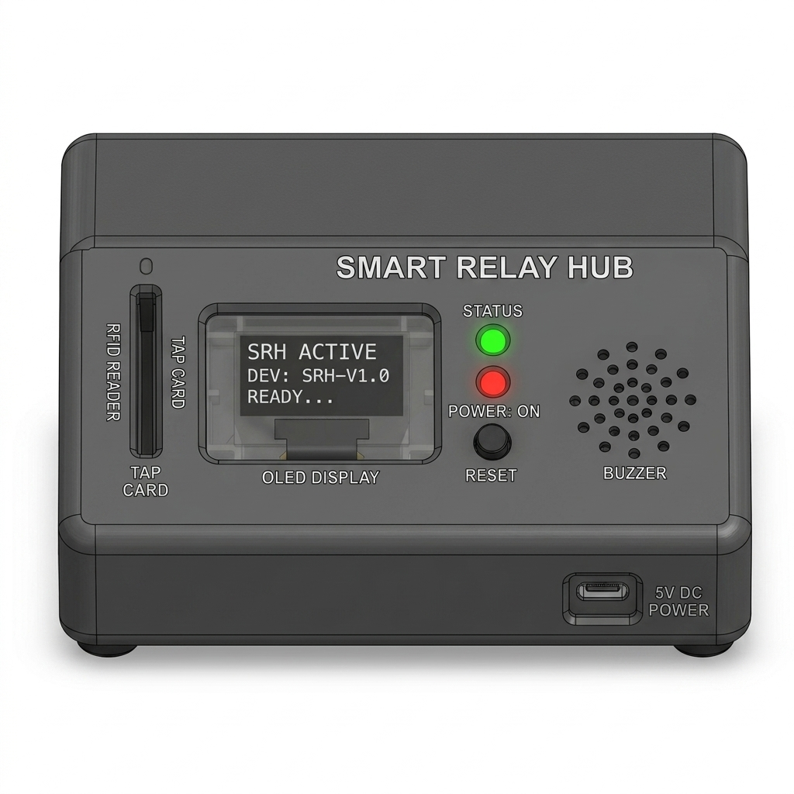

# Smart Relay Hub CAD Enclosure Design

This document details the mechanical design, 3D printing parameters, and assembly instructions for the **Smart Relay Hub** enclosure.

---

## 1. Mechanical Enclosure Specifications

The Smart Relay Hub housing is designed as an ergonomic desktop-friendly, wedge-shaped console enclosure. The physical design files are provided as a high-fidelity 3D STEP model: [Smart_Relay_Hub_closed.step](file:///c:/Users/lakshanya/OneDrive/Desktop/veri/VeriRoute_Nexus/hardware_submission/cad/Smart_Relay_Hub_closed.step) (migrated from the legacy STL format). It features distinct cutouts for the user interface components (OLED, LEDs, button) and has mounting slots for the internally-positioned RFID reader and ESP32 board.

* **Dimensions**:
  + **Width**: 110.0 mm
  + **Depth**: 80.0 mm
  + **Height (Rear Wall)**: 55.0 mm
  + **Height (Front Lip)**: 25.0 mm
  + **Slope Angle**: 35°
* **Wall Thickness**: 2.0 mm (provides structural rigidity while saving filament)
* **Material Selection**:
  + **Matte Black or Dark Grey PLA/PETG** (for the main chassis)
  + **Clear Acrylic or Transparent PLA** (0.8mm sheet for the OLED and LED protective window)
* **Mounting Method**: Internal snap-fits for the PCB, with M2.5 self-tapping screws for securing the bottom cover.

---

## 2. Designated Cutouts & Interfaces

1. **OLED Screen Cutout**: $26.0\text{ mm} \times 15.0\text{ mm}$ rectangular window centered on the sloped top face.
2. **LED Indicators**: 2x 5.2 mm circular holes, stacked vertically, labeled `STATUS` (Green LED top, Red LED below).
3. **RFID Card Slot**: $40.0\text{ mm} \times 3.0\text{ mm}$ vertical slot on the left side of the sloped face.
4. **Reset/Tactile Button Cutout**: 10.2 mm circular hole placed below the LEDs.
5. **Power Cable Inlet**: $12.0\text{ mm} \times 6.5\text{ mm}$ slot located on the bottom-right front lip.
6. **Buzzer Vent**: Small grille matrix (19x 1.5mm holes in a circular matrix) on the right side of the sloped face.

---

## 3. 3D Printing Settings (FDM)

To print a high-quality, professional shell on a standard FDM printer (e.g. Ender 3, Bambu Lab), configure the slicer with the following parameters:

* **Layer Height**: 0.2 mm
* **Infill Density**: 15% (Grid or Gyroid pattern)
* **Shells/Perimeters**: 3 (ensures robust screw holes)
* **Support Material**: Required (enable "Tree/Organic supports" for the internal RFID shelf overhangs)
* **Print Orientation**: Place the sloped top face flat on the build plate (face-down) to achieve a smooth textured finish and avoid printing internal supports.

---

## 4. Visual Enclosure CAD Mockup

Below is the 3D CAD render of the Smart Relay Hub enclosure design:

