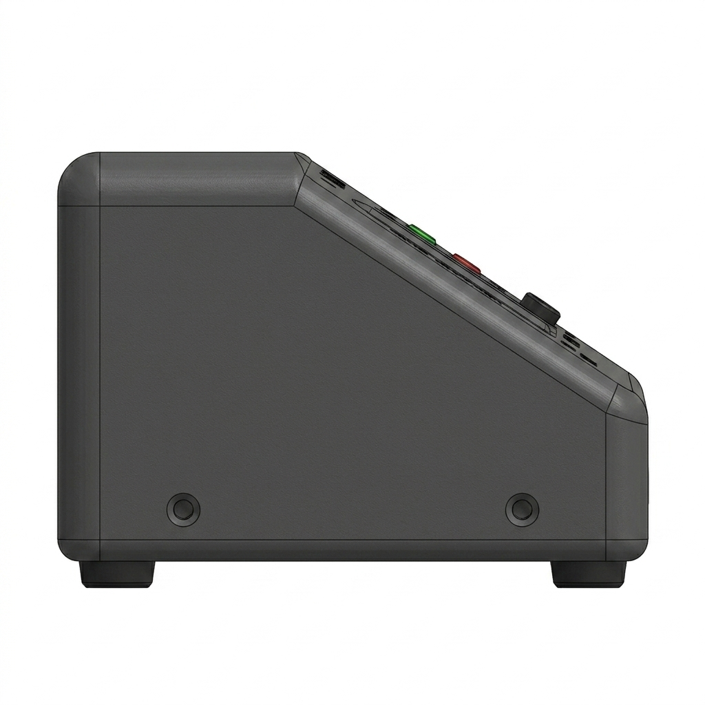
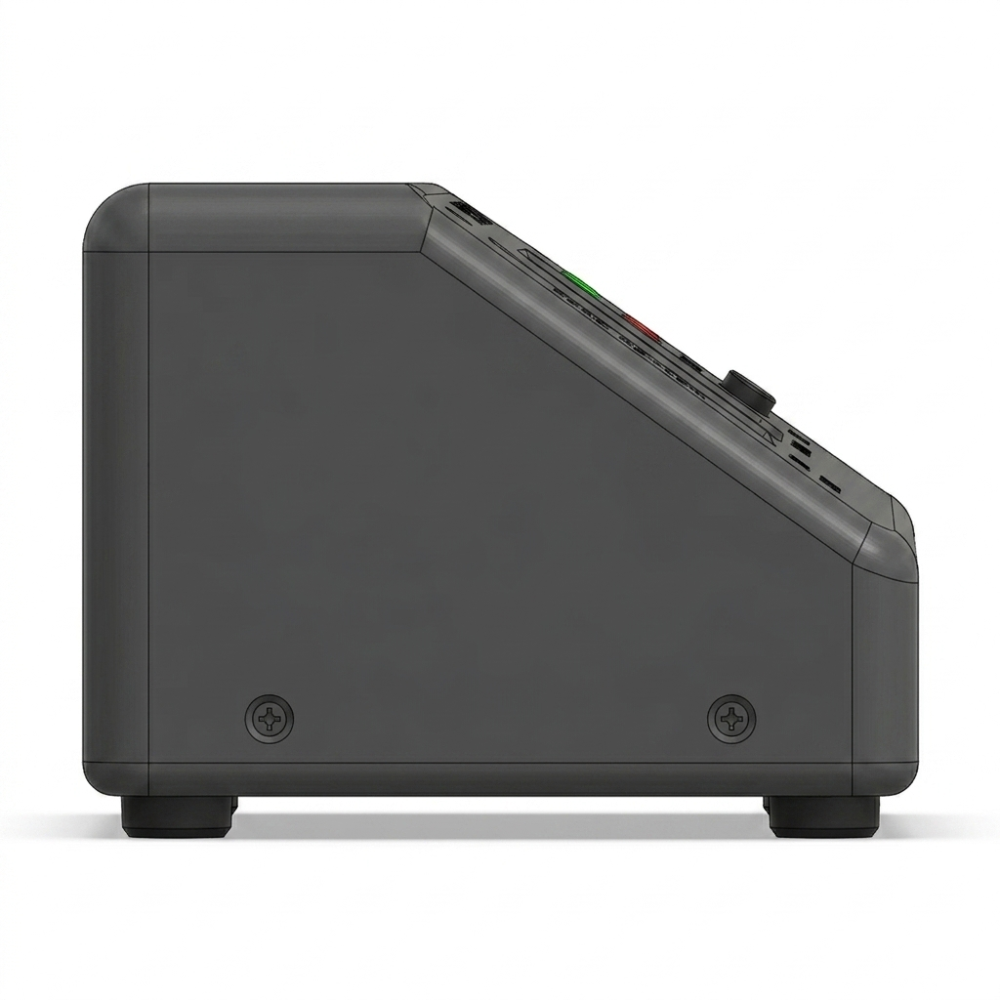
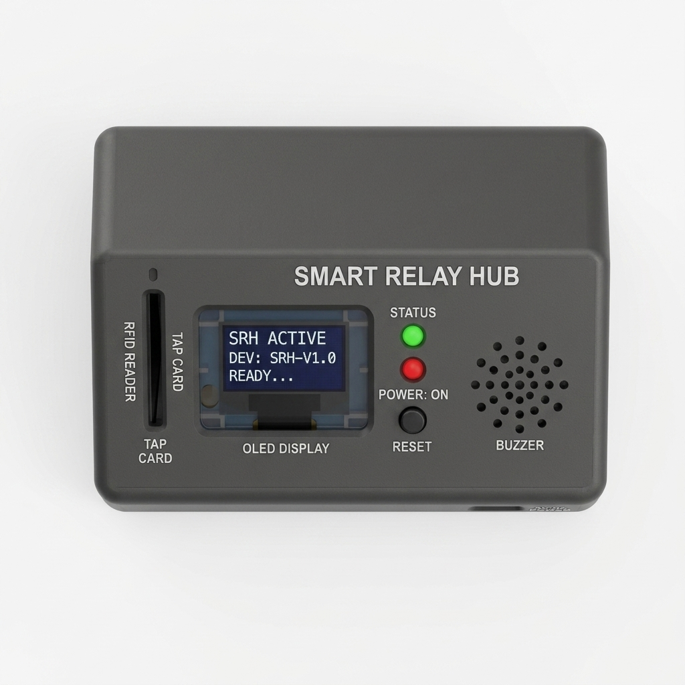
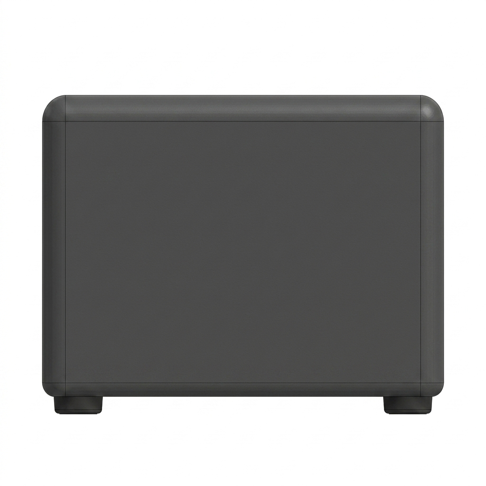

# Smart Relay Hub CAD Enclosure Specification

This document details the mechanical design, orthographic views, and approximate physical dimensions of the **Smart Relay Hub** sloped desktop console enclosure, corresponding to the reference design.

---

## 1. Outer Dimensions & Geometry

The Smart Relay Hub housing is designed as an ergonomic, desktop-friendly wedge-shaped console. The sloped top face places all interactive elements (RFID scanner, OLED display, indicators, and buttons) at a convenient angle for user interactions.

| Parameter | Specification | Description |
| :--- | :--- | :--- |
| **Width** | 110.0 mm | Total width of the console casing |
| **Depth** | 80.0 mm | Total front-to-back depth |
| **Height (Rear Wall)** | 55.0 mm | Height of the vertical back panel |
| **Height (Front Lip)** | 25.0 mm | Height of the short vertical front lip |
| **Slope Angle** | 35° | Angled slant of the active console face |
| **Wall Thickness** | 2.0 mm | Structural shell thickness for durability |
| **Material** | Matte Dark Gray PLA / ABS | Rigid plastic housing with textured matte finish |

---

## 2. Cutouts & Interface Dimensions

All slots, holes, and cutouts are sized to accommodate standard electronics components with standard tolerances (typically +0.2mm buffer):

| Component | Cutout Dimensions | Labeling & Placement |
| :--- | :--- | :--- |
| **RFID Card Slot** | $40\text{ mm} \times 3\text{ mm}$ vertical slot | Labeled `RFID READER` and `TAP CARD` on left side of sloped face |
| **OLED Screen Cutout** | $26\text{ mm} \times 15\text{ mm}$ rectangular window | Labeled `OLED DISPLAY` in the center of the sloped face |
| **LED Indicators** | 2x 5.2 mm circular holes, stacked vertically | Labeled `STATUS` (Green LED top, Red LED below) |
| **Reset Button Cutout** | 10.2 mm circular hole | Labeled `RESET` and `POWER: ON`, placed below LEDs |
| **Buzzer Grill** | 19x 1.5 mm diameter holes in a circular matrix | Labeled `BUZZER` on the right side of the sloped face |
| **Power Port Cutout** | $12\text{ mm} \times 6.5\text{ mm}$ opening | Labeled `5V DC POWER`, located on the bottom-right front lip |
| **Rubber Feet Recesses** | 4x 10.0 mm diameter circular recesses | Located at the four corners of the bottom base panel |

---

## 3. Orthographic CAD Views

The following 3D CAD renders represent the orthographic projections of the Smart Relay Hub console. The design, colors, and textures match the reference device layout:

````carousel

<!-- slide -->

<!-- slide -->

<!-- slide -->

<!-- slide -->

````
