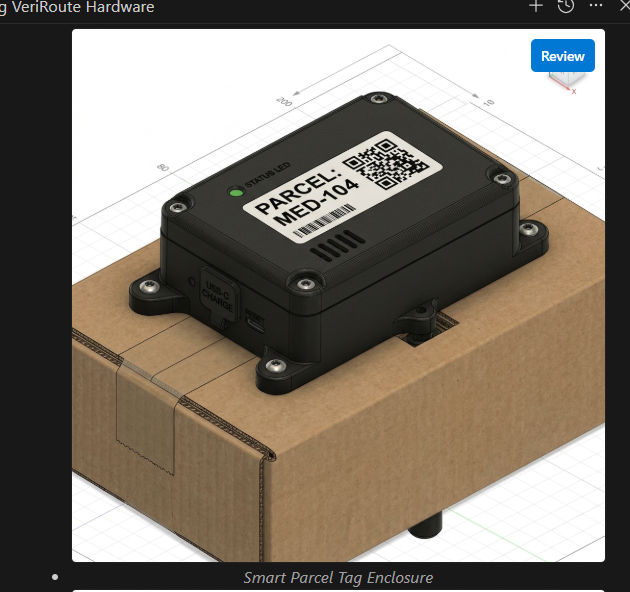
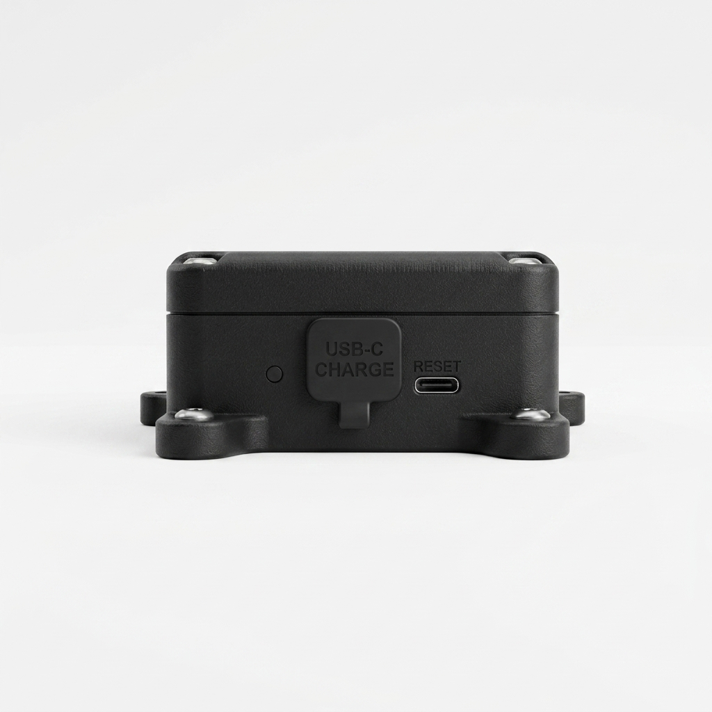
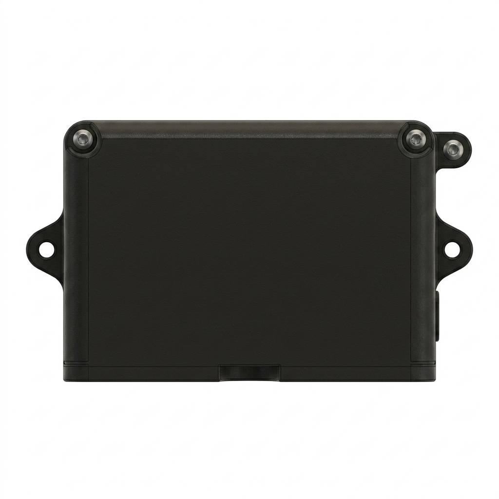
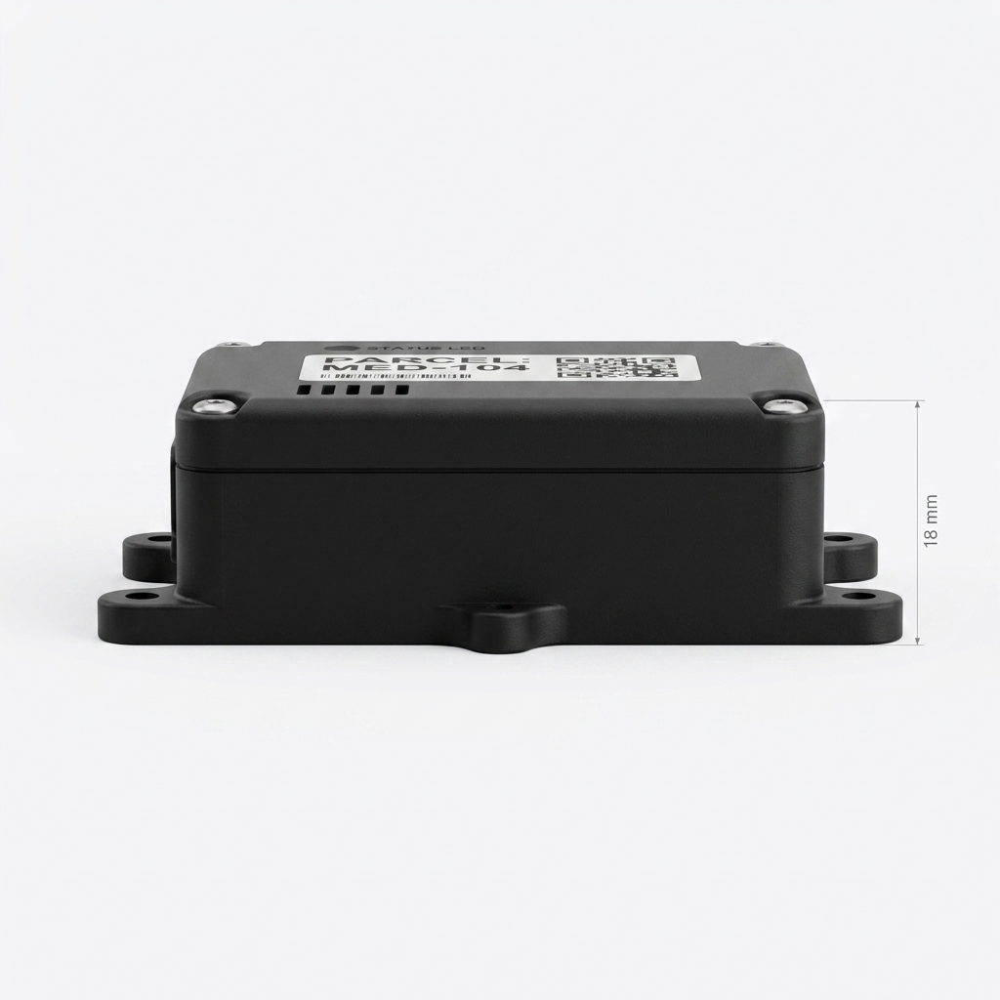

# Smart Parcel Tag CAD Enclosure Specification

This document details the mechanical design, orthographic views, and approximate physical dimensions of the active **Smart Parcel Tag** enclosure, corresponding to the reference design. The source design is available as a high-fidelity 3D STEP model: [Smart_Parcel_Tag_closed.step](../cad/Smart_Parcel_Tag_closed.step).

---

## 1. Outer Dimensions & Geometry

The Smart Parcel Tag is a compact, rugged rectangular enclosure designed to be mounted directly onto medicine transport containers or cargo cardboard boxes. It features four corner mounting brackets ("ears") to secure it in place during transport.

| Parameter | Specification | Description |
| :--- | :--- | :--- |
| **Width (Body)** | 45.0 mm | Casing body width |
| **Width (with Mounting Ears)** | 62.0 mm | Total width including mounting brackets |
| **Depth** | 35.0 mm | Front-to-back depth |
| **Height** | 18.0 mm | Ultra-slim profile height to prevent conveyor snags |
| **Wall Thickness** | 1.5 mm | Wall thickness for structural integrity |
| **Material** | Matte Black ABS / Polycarbonate | Impact-resistant engineering plastic shell |
| **Mounting** | 4x M3 screw brackets (ears) | Screw-down mounts at bottom corners |

---

## 2. Cutouts & Interface Dimensions

All cutouts are precision-designed to accommodate internal ESP32-C3 modules, DHT22 sensor, rechargeable battery, and external interfaces:

| Component | Cutout Dimensions | Labeling & Placement |
| :--- | :--- | :--- |
| **Ventilation Slits** | 5x $12.0\text{ mm} \times 1.0\text{ mm}$ slits | Placed on the top cover directly over the DHT22 sensor |
| **Tamper Switch cutout** | $5.0\text{ mm} \times 3.0\text{ mm}$ opening | Placed on the bottom face for the physical limit switch arm |
| **USB-C Charging Inlet** | $9.0\text{ mm} \times 4.5\text{ mm}$ opening | Labeled `USB-C CHARGE` with rubber protective flap on front wall |
| **Reset Button cutout** | 3.0 mm circular hole | Labeled `RESET` on front wall |
| **Status LED Guide** | 2.0 mm circular lightpipe hole | Labeled `STATUS LED` on top cover |
| **Top Lid Fasteners** | 4x M2.5 threaded screw holes | Positioned at the top corners to secure the enclosure lid |

---

## 3. CAD Views Visual Gallery

The following 3D CAD renders represent the orthographic and layout views of the Smart Parcel Tag. The design, colors, and textures match the reference device layout:

````carousel

<!-- slide -->

<!-- slide -->

<!-- slide -->

````
